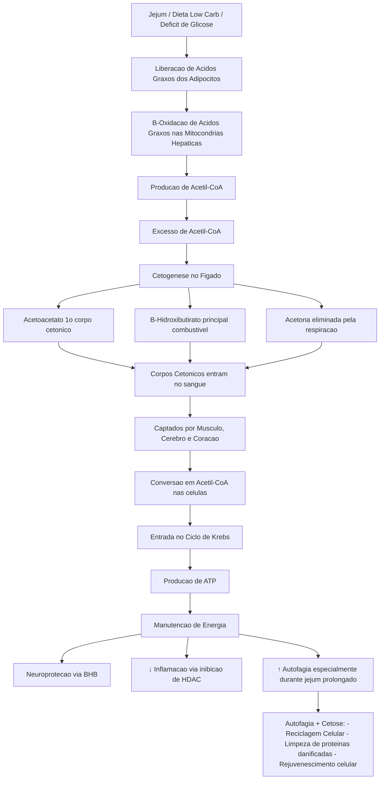

# 📚 Plano de Estudos — Aprofundamento em Cetose, Corpos Cetônicos e Autofagia

---

## 🧱 Etapa 1 — Fundamentos de Bioquímica (2 semanas)

**Objetivo:**  
Entender profundamente o metabolismo energético normal e cetogênico.

**Leituras:**
- *Principles of Biochemistry* — Lehninger
- *Biochemistry* — Stryer

**Atividades:**
- Mapear o processo de β-oxidação → cetogênese → corpos cetônicos
- Anotar as principais enzimas envolvidas

---

## 🔬 Etapa 2 — Cetose como Ferramenta Metabólica (2 a 3 semanas)

**Objetivo:**  
Compreender como induzir, monitorar e manter estados de cetose.

**Leituras:**
- *The Art and Science of Low Carbohydrate Living* — Jeff Volek & Stephen Phinney
- Artigos:
  - [Biochemistry, Ketogenesis (PubMed 29630231)](https://pubmed.ncbi.nlm.nih.gov/29630231/)
  - [Ketone Bodies as Signaling Metabolites (PubMed 24140022)](https://pubmed.ncbi.nlm.nih.gov/24140022/)

---

## 🧠 Etapa 3 — Cetose, Cérebro e Autofagia (3 semanas)

**Objetivo:**  
Estudar o impacto da cetose no sistema nervoso e nos processos celulares de reciclagem.

**Leituras:**
- [Ketone Bodies in the Brain Beyond Fuel Metabolism (PubMed 34512261)](https://pubmed.ncbi.nlm.nih.gov/34512261/)
- [Metabolic and Signaling Roles of Ketone Bodies (PubMed 34633859)](https://pubmed.ncbi.nlm.nih.gov/34633859/)
- *Autophagy and Metabolism* — capítulos selecionados

---

## 🧪 Etapa 4 — Aplicação Prática Controlada (4 a 6 semanas)

**Objetivo:**  
Testar de forma segura a indução de cetose e observar efeitos cognitivos e metabólicos.

**Experimentos sugeridos:**
- Dieta low-carb
- Cetose leve
- Jejum intermitente (16:8)

**Cuidados:**
- Hidratação e eletrólitos
- Monitoramento de energia, foco e humor
- Exames laboratoriais

---

# 🗺️ Fluxo Resumido em Mermaid Chart

